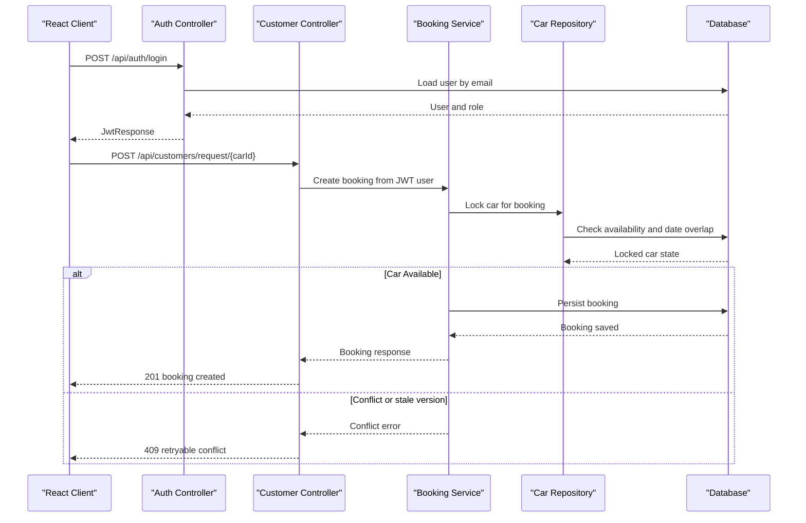

# API & Service Communication Contracts

The application exposes a single Spring REST API on port 8080 consumed by a React client. Communication is synchronous JSON or multipart HTTP secured by stateless JWT authentication; no message broker, service discovery, API gateway, or circuit-breaker integration was found.

## Service Catalog

| Service | Port | Category | Purpose |
|---|---:|---|---|
| Car Rental REST API | 8080 | API and business | Authentication, users, vehicles, bookings, bids, administration, and profile operations |
| React web client | 3000 | Client | Public catalog, role dashboards, profile management, booking and fleet workflows |
| MySQL/H2 persistence | configured externally | Infrastructure | Production persistence and test persistence |

## API Endpoints Inventory

| Service | Method | Path | Request Type | Response Type |
|---|---|---|---|---|
| AuthController | POST | `/api/auth/register` | `UserRegistrationRequest` JSON | `UserResponse`, 201 |
| AuthController | POST | `/api/auth/login` | `LoginRequest` JSON | `JwtResponse`, 200 |
| CarController | POST | `/api/cars/add` | Multipart car and images | Car response |
| CarController | PUT | `/api/cars/{id}` | Multipart car and images | Car response |
| CarController | PATCH | `/api/cars/{id}/bid-status` | Status request | Car response |
| CarController | GET | `/api/cars/available` | Query-free | Car list |
| CarController | GET | `/api/cars/my-cars` | JWT owner context | Car list |
| CarController | GET | `/api/cars/agency/{agencyId}` | Path id | Car list |
| CarController | GET | `/api/cars/owner/{ownerId}` | Path id | Car list |
| CarController | GET | `/api/cars/{id}` | Path id | Car response |
| CarController | GET | `/api/cars/{id}/image/{index}` | Path ids | Image bytes |
| CarController | PATCH | `/api/cars/{id}/availability` | Availability request | Car response |
| CarController | DELETE | `/api/cars/{id}` | Path id | Empty or message |
| BookingController | POST | `/api/bookings/create` | Booking request JSON | Booking response |
| BookingController | GET | `/api/bookings/{id}` | Path id | Booking response |
| BookingController | GET | `/api/bookings/customer/{customerId}` | Path id | Booking list |
| BookingController | GET | `/api/bookings/car/{carId}` | Path id | Booking list |
| BookingController | GET | `/api/bookings/agency/{agencyId}` | Path id | Booking list |
| BookingController | PATCH | `/api/bookings/{id}/status` | Status request | Booking response |
| BookingController | PATCH | `/api/bookings/{id}/cancel` | Path id | Booking response |
| CustomerController | POST | `/api/customers` and `/api/customers/json` | Multipart or JSON customer request | Customer response |
| CustomerController | GET | `/api/customers`, `/api/customers/{id}`, `/api/customers/user/{userId}` | Query/path ids | Customer response/list |
| CustomerController | GET | `/api/customers/{id}/image` | Path id | Image bytes |
| CustomerController | PUT/PATCH | `/api/customers/{id}` | Multipart or JSON profile update | Customer response |
| CustomerController | POST | `/api/customers/request/{carId}` | Booking request JSON | Booking response |
| CustomerController | GET | `/api/customers/my-bookings` | JWT customer context | Booking list |
| CustomerController | DELETE | `/api/customers/{id}` or `/api/customers/{id}/image` | Path id | Empty or message |
| AgencyController | POST/GET/PUT/PATCH/DELETE | `/api/agency/**` | Agency DTOs, multipart data, path ids | Agency, car, bid, and booking responses |
| AgencyController | GET/PATCH | `/api/agency/cars`, `/api/agency/cars/{carId}/availability` | JWT agency context | Car list or car response |
| AgencyController | GET/PATCH | `/api/agency/bids`, `/api/agency/bids/{id}/status` | JWT context and status request | Bid list or bid response |
| AgencyController | GET/PATCH | `/api/agency/bookings`, `/api/agency/bookings/{bookingId}/status` | JWT context and status request | Booking list or booking response |
| OwnerController | POST/GET/PUT/PATCH/DELETE | `/api/owner/**` | Owner DTOs, multipart data, path ids | Owner and profile responses |
| OwnerController | POST/PUT/DELETE/PATCH | `/api/owner/cars/**` | Multipart car data or path ids | Car response |
| OwnerController | POST/GET/DELETE | `/api/owner/bids/**` | `OwnerBidRequest`, path ids | Bid response/list |
| OwnerController | GET | `/api/owner/agencies` | JWT owner context | Agency list |
| AdminController | GET | `/api/admin/summary`, `/api/admin/users`, `/api/admin/agencies`, `/api/admin/cars`, `/api/admin/bids`, `/api/admin/bookings` | Optional path/query filters | Summary or resource lists |
| AdminController | GET | `/api/admin/users/{id}`, `/api/admin/users/email`, `/api/admin/users/role/{role}`, `/api/admin/users/status/{status}` | Path/query filters | User response/list |
| AdminController | PUT/PATCH/DELETE | `/api/admin/users/**`, `/api/admin/agencies/**`, `/api/admin/cars/**`, `/api/admin/bids/**`, `/api/admin/bookings/**` | DTOs, status requests, path ids | Updated resource or message |

## Management & Observability Endpoints

No Spring Actuator, Prometheus, custom metrics, or health endpoint was found. The client receives `backend:online` and `backend:offline` browser events based on HTTP outcomes, but these are not server management endpoints.

## DTOs & Contracts

Authentication uses `LoginRequest`, `UserRegistrationRequest`, and `JwtResponse`. Profile and domain operations use customer, owner, agency, booking, car, bid, address, status, and `UserResponse` DTOs. Multipart endpoints combine JSON-like form fields with image files. DTOs are mutable Lombok-backed Java objects; no OpenAPI, protobuf, or GraphQL contract was found. JSON serialization is provided by Spring/Jackson defaults.

## Communication Patterns

- Client-to-API communication is synchronous REST over HTTP using Axios.
- The API uses direct service/repository calls inside one deployable Spring application; no inter-service calls or asynchronous messaging were found.
- JWT is sent in the `Authorization` header. Spring Security applies role-based endpoint authorization and method security is enabled.
- CORS explicitly allows local development origins. HTTPS/TLS is not configured in the inspected source and should be enforced at the production ingress or reverse proxy.
- Axios uses a five-second client timeout and emits browser online/offline events. No retry, circuit breaker, bulkhead, or server-side timeout policy was found.
- Booking and car updates use pessimistic locking plus optimistic entity versions to protect concurrent operations. API conflicts are surfaced as HTTP 409 by the global exception handler.
- There is no API gateway or service discovery layer. The frontend currently uses a configured localhost API base URL.

## Service Technology Matrix

| Service | Web | Data Access | Discovery | Gateway | Actuator | Cache | Metrics |
|---|---|---|---|---|---|---|---|
| Car Rental REST API | Spring MVC | Spring Data JPA | None | None | None found | None found | None found |
| React web client | React Router and Axios | Browser session storage | None | Client only | None | None | Browser connectivity events |

## Service Communication Sequence

<!-- mermaid-checked: every participant uses `participant Id as "Label"`, no \n in aliases/messages/notes, every alt/opt/loop closed by end, no `:` inside any alias -->

